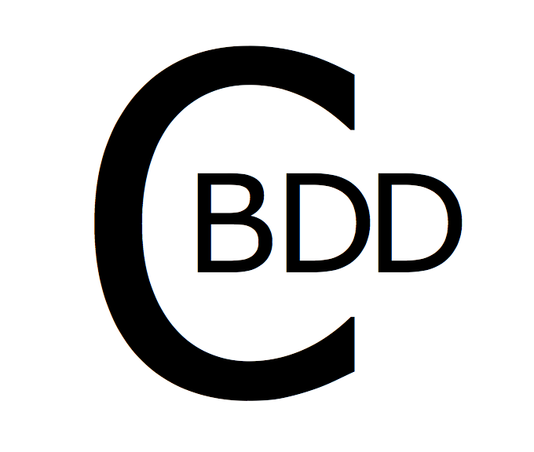

##CBDD allows you to write elegant and expressive tests in C

# usage
    #include <cbdd.h>

    int main() {
      __block char *str;
      
      describe("c strings", ^{
        before_each(^{
          str = "hi";
        });

        it("is a null terminated array of char's", ^{
          expect_equal('\0', *(str + 2));
        });

        it("has a syntactic sugar", ^{
          expect_equal('R', str[2]);
        });
      });
      return 0;
    }

running the test is just **as simple as compiling a C program**:
    
    $clang test.c -lcbdd
    $./a.out

    c strings
    - is a null terminated array of char's
    - has a syntactic sugar
    FAILED
    expected: 82
    got: 0
    main.c:17

## Features
* Beautiful Rspec like syntax.
* Tests are executed at the spot where they were defined. In other words, there is no need for explicit test runners. Think of how many times you have written a test but forgot to call it.
* No marco hacks. describe(), it() etc...  are all pure C functions. 
* Flexible, since every module's tests are within a main() function, the choice is open for how to run them. For example, you might want to write a simple bash script to compile all files ending with '_tests'
* eloquent failure messages.

## Installation
#Mac 
clone the repo:
    
    git clone https://github.com/nassersala/cbdd.git
change to cbdd directory
   
     $cd cbdd

build and install:

    $make 
    $make install

#Linux
before 'make' and 'make install', you need to have llvm, clang and BlocksRuntime installed:

    $sudo apt-get install llvm
    $sudo apt-get install clang
    $sudo apt-get install libblocksruntime-dev

the previous example would have been compiled as follows:

    $clang test.c -fblocks -lBlocksRuntime -lcbdd

##Available expectations
    expect_equal(exp, act)
    refute_equal(exp, act) //expect not equal
    expect_equal_string(str1, str2) 
    refute_equal_string(str1, str2)
    expect_true(exp)
    expect_false(exp)
    expect_null(exp)
    refute_null(exp)

##before_each and sisters
    before_each(^{}) //runs before every test in a describe block
    after_each(^{})  //runs after every test
    before_all(^{})  //runs once before all tests 
    after_all(^{})   //runs once after all tests

## what is BDD?
from [Wikipedia](http://en.wikipedia.org/wiki/Behavior-driven_development)

> In software engineering, behavior-driven development (abbreviated BDD) is a software development process based on test-driven development (TDD). Behavior-driven development combines the general techniques and principles of TDD with ideas from domain-driven design and object-oriented analysis and design to provide software developers and business analysts with shared tools and a shared process to collaborate on software development, with the aim of delivering "software that matters".

## Crafted By:
Nasser Ali Alzahrani [@nassersala](http://twitter.com/nassersala)

## License
Licensed under the Apache License, Version 2.0

